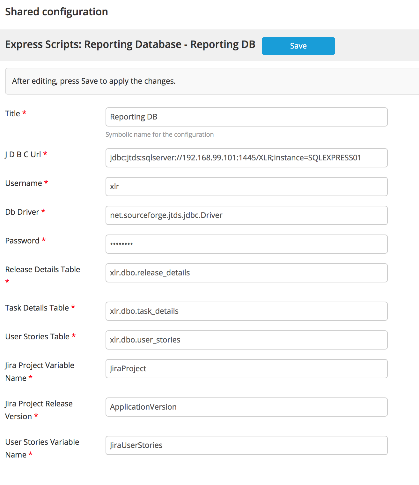

# es-xlr-sqlExportHook-plugin
Plugin to export release to MSSQL database

## Build ##

./gradlew clean build

## Installation ##

Place the latest released version under the `plugins` dir.

## Description ##

The plugin uses EventHandler mechanism in XLRelease to push the Release and associated data to external database.

Events subscribed are
1. CisCreated - Whenever a release is created, it is pushed to external reporting database
2. CisUpdated - Whenever a running  release is modified the release and associated data is pushed to external reporting database (including when release is marked COMPLETED or ABORTED)

Note: Create only one Reporting Database Config 

